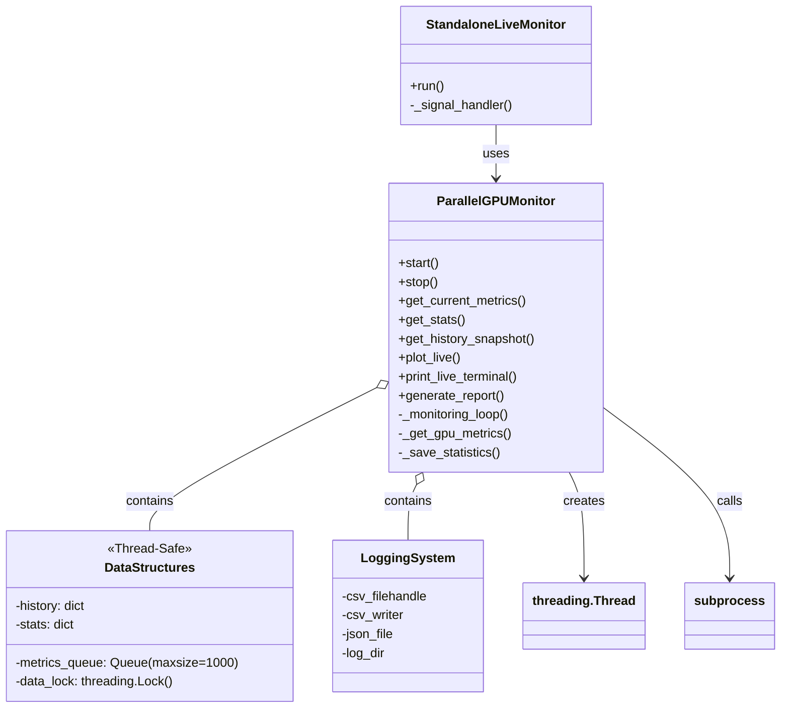
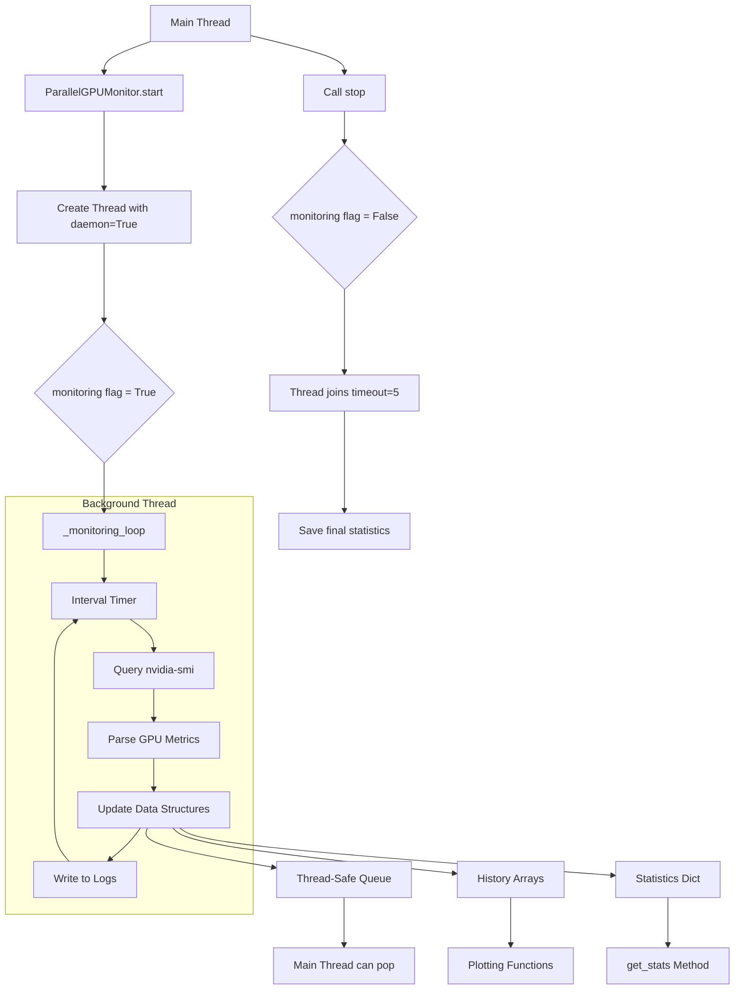
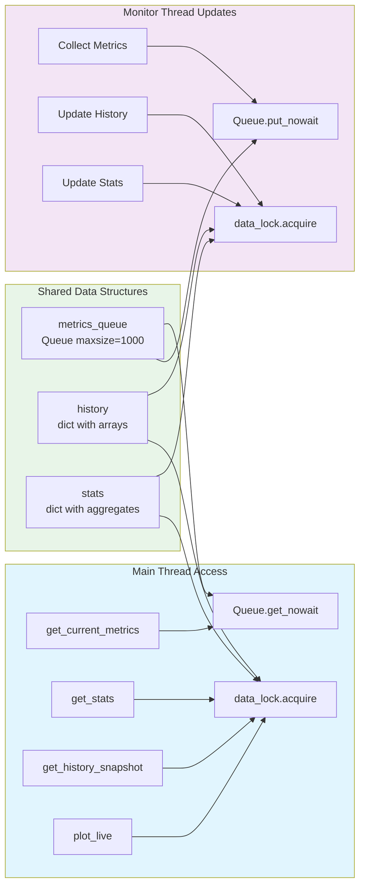
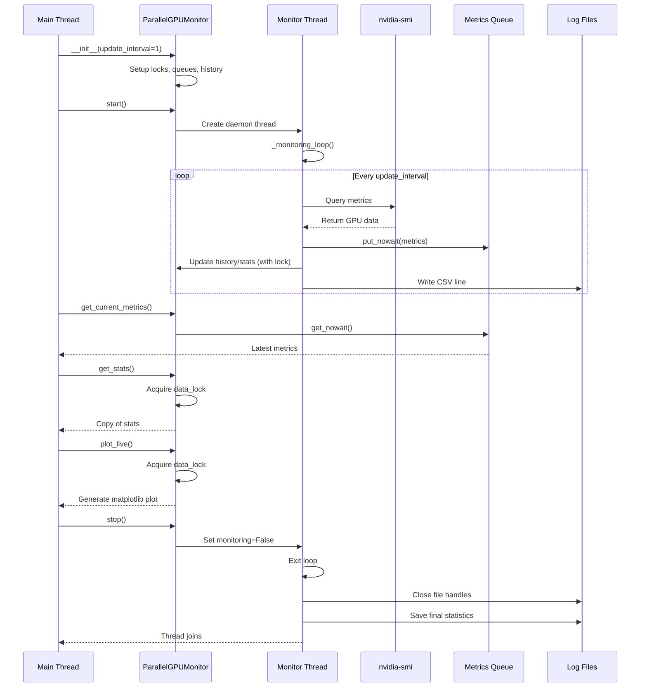
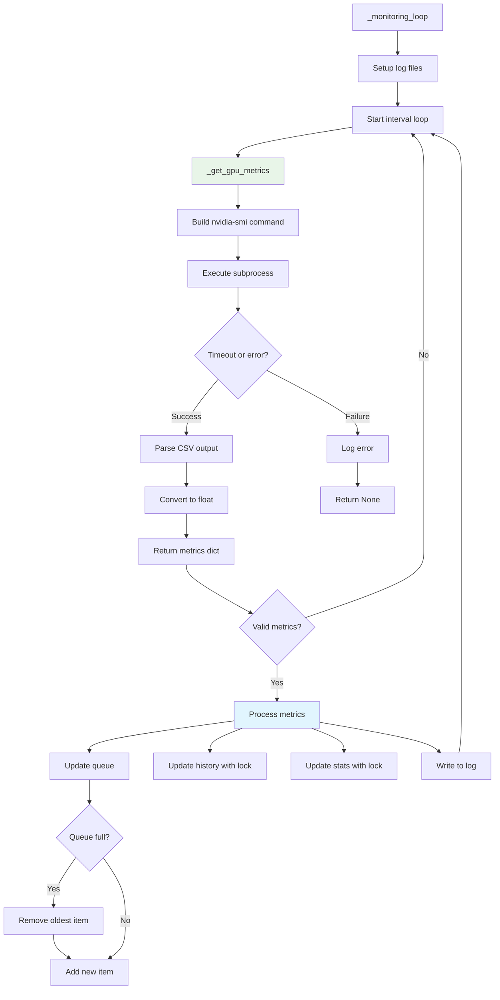

# Parallel GPU Monitor - Architecture Diagrams

Here are accurate technical diagrams for the GPU monitoring system architecture and workflows:

## Diagram 1: System Architecture & Components

## Diagram 2: Threading Model & Data Flow

## Diagram 3: Data Structures & Thread Safety

## Diagram 4: Monitoring Sequence & Lifecycle

## Diagram 5: Command Execution Flow

